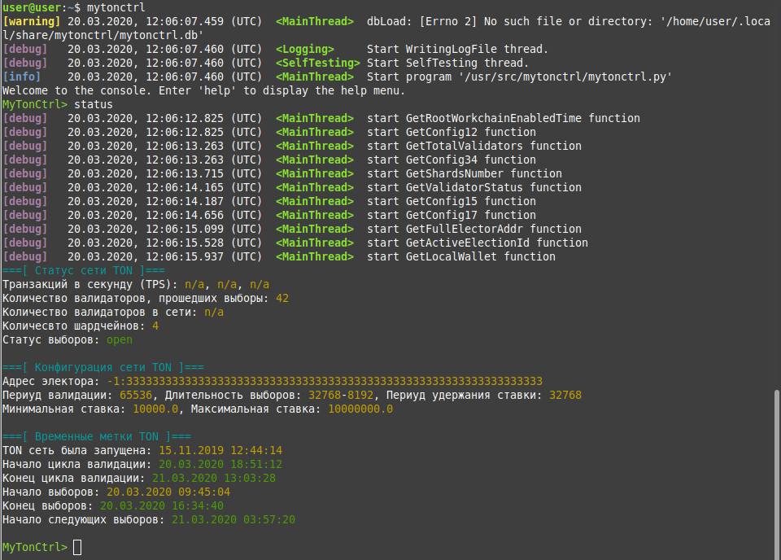

     

<!-- omit from toc --> 
# MyTonCtrl
[Данный текст доступен на русском языке.](README.Ru.md)

<!-- omit from toc --> 
## Contents

- [What is MyTonCtrl?](#what-is-myttonctrl)
- [Functionality](#functionality)
	- [List of tested operating systems](#list-of-tested-operating-systems)
- [Installation](#installation)
	- [Installation scripts overview](#installation-scripts-overview)
	- [Installation modes](#installation-modes)
	- [Installation for Ubuntu](#installation-for-ubuntu)
	- [Installation for Debian](#installation-for-debian)
- [MyTonCtrl Documentation](#mytonctrl-documentation)
- [Telemetry](#telemetry)
- [MyTonCtrl installer mode](#mytonctrl-installer-mode)
	- [Web admin panel](#web-admin-panel)
	- [Local copy of toncenter](#local-copy-of-toncenter)
- [Useful links](#useful-links)


# What is MyTonCtrl?
MyTonCtrl is a console application that serves as a convenient wrapper for `fift`, `lite-client`, and `validator-engine-console`. It has been specifically developed to streamline wallet, domain, and validator management tasks on the Linux operating system.



# Functionality
- [x] Show TON network status
- [x] Management of local wallets
	- [x] Create local wallet
	- [x] Activate local wallet
	- [x] Show local wallets
	- [x] Import wallet from file (.pk)
	- [x] Save wallet address to file (.addr)
	- [x] Delete local wallet
- [x] Show account status
	- [x] Show account balance
	- [x] Show account history
	- [x] Show account status from bookmarks
- [x] Transferring funds to the wallet
	- [x] Transfer of a fixed amount
	- [x] Transfer of the entire amount (all)
	- [x] Transfer of the entire amount with wallet deactivation (alld)
	- [x] Transferring funds to the wallet from bookmarks
	- [x] Transferring funds to a wallet through a chain of self-deleting wallets
- [x] Manage bookmarks
	- [x] Add account to bookmarks
	- [x] Show bookmarks
	- [x] Delete bookmark
- [x] Offer management
	- [x] Show offers
	- [x] Vote for the proposal
	- [x] Automatic voting for previously voted proposals
- [x] Domain management
	- [x] Rent a new domain
	- [x] Show rented domains
	- [x] Show domain status
	- [x] Delete domain
	- [ ] Automatic domain renewal
- [x] Controlling the validator
	- [x] Participate in the election of a validator
	- [x] Return bet + reward
	- [x] Autostart validator on abnormal termination (systemd)
	- [x] Send validator statistics to https://toncenter.com

## List of tested operating systems
| Operating System              | Status                     |
|-------------------------------|----------------------------|
| Ubuntu 16.04 LTS (Xenial Xerus) | Error: TON compilation error |
| Ubuntu 18.04 LTS (Bionic Beaver) | OK                       |
| Ubuntu 20.04 LTS (Focal Fossa) | OK                       |
| Ubuntu 22.04 LTS (Jammy Jellyfish) | OK                   |
| Debian 8 | Error: Unable to locate package libgsl-dev   |
| Debian 9 | Error: TON compilation error                 |
| Debian 10 | OK                                         |

# Installation
## Installation scripts overview
- `toninstaller.sh`: clones `TON` and` mytonctrl` sources to `/usr/src/ton` and`/usr/src/mytonctrl` folders, compiles programs from sources and writes them to `/usr/bin/`.
- `mytoninstaller.py`: configures the validator and `mytonctrl`; generates validator connection keys.

## Installation modes
There are two installation modes: `lite` and`full`. They both **compile** and install `TON` components. However the `lite` version does not configure or run the node/validator.

## Installation for Ubuntu
1. Download and execute the `install.sh` script in the desired installation mode. During installation the script prompts you for the superuser password several times.
	```sh
	wget https://raw.githubusercontent.com/ton-blockchain/mytonctrl/master/scripts/install.sh
	sudo bash install.sh -m <mode>
	```

2. Done. You can try to run the `mytonctrl` console now.
	```sh
	mytonctrl
	```


## Installation for Debian
1. Download and execute the `install.sh` script in the desired installation mode. During installation the script prompts you for the superuser password several times.
	```sh
	wget https://raw.githubusercontent.com/ton-blockchain/mytonctrl/master/scripts/install.sh
	su root -c 'bash install.sh -m <mode>'
	```

2. Done. You can try to run the `mytonctrl` console now.
	```sh
	mytonctrl
	```

# MyTonCtrl Documentation

This repository contains the following technical documents for MyTonCtrl, categorized by language. Simply click the links below to navigate to the document you're interested in.

|   | FAQ | Import Wallets | Ubuntu Manual | Nominator Pool |
|:-:|:---:|:-------------:|:-------------:|:--------------:|
| **English (EN)** | [Link](./docs/en/FAQ.md) | [Link](./docs/en/import-wallets.md) | [Link](./docs/en/manual-ubuntu.md) | [Link](./docs/en/nominator-pool.md) |
| **Russian (RU)** | [Link](./docs/ru/FAQ.md) | [Link](./docs/ru/import-wallets.md) | [Link](./docs/ru/manual-ubuntu.md) | [Link](./docs/ru/nominator-pool.md) |
| **Traditional Chinese** | [Link](./docs/zh_TW/FAQ.md) | [Link](./docs/zh_TW/import-wallets.md) | [Link](./docs/zh_TW/manual-ubuntu.md) | [Link](./docs/zh_TW/nominator-pool.md) |


# Telemetry
By default, `mytonctrl` sends validator statistics to the https://toncenter.com server.
It is necessary to identify network abnormalities, as well as to quickly give feedback to developers.
To disable telemetry during installation, use the `-t` flag:
```sh
sudo bash install.sh -m <mode> -t
```

To disable telemetry after installation, do the following:
```sh
MyTonCtrl> set sendTelemetry false
```

# MyTonCtrl installer mode

## Web admin panel
To control the node/validator through the browser, you need to install an additional module:
`mytonctrl` -> `installer` -> `enable JR`

Next, you need to create a password for connection:
`mytonctrl` -> `installer` -> `setwebpass`

Ready. Now you can go to https://tonadmin.org site and log in with your credentials.
git: https://github.com/igroman787/mtc-jsonrpc

## Local copy of toncenter
To set up a local https://toncenter.com copy on your server, install an additional module:
`mytonctrl` ->`installer` -> `enable PT`

Ready. A local copy of toncenter is available at `http://<server-ip-address>:8000`
git: https://github.com/igroman787/pytonv3

# Useful links
* https://docs.ton.org/